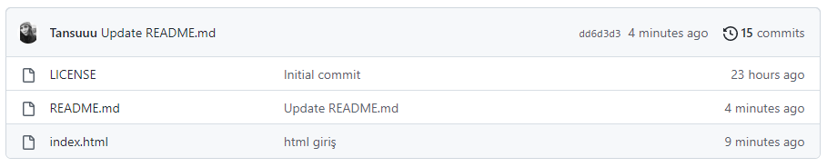

# Kodluyoruz İlk Repo
Bu repo Kodluyoruz Front-End Eğitiminde oluşturduğumuz ilk repo. İçerisinde bir adet README dosyası, bir adet index.html barındırıyor.

Bu repo [patika.dev](www.patika.dev) platformu GİT dersleri için oluşturulmuştur.

## Ödevin amacı

*GitHub'da repo oluşturmak.
*GitHub'da oluşturulan repoyu bilgisayara almak.
*Repo üzerinde değişiklik yaparak tekradan GitHub'a göndermek.

## Installation

Ilk olarak repoyu bilgisayarınıza klonlayın.

`
git clone https://github.com/Tansuuu/kodluyoruzilkrepo.git
`

## Usage

Projeyi cloneladıktan sonra Visual Studio Code programında açınız.

`
cd kodluyoruzilkrepo
code .
`

## Contributing

Kodluyoruz ekibine teşekkürler!*

*Not: Pull requestler kabul edilir. Büyük değişiklikler için, lütfen önce neyi değiştirmek istediğinizi tartışmak için bir konu açınız.*

## License

[MIT](https://choosealicense.com/)

